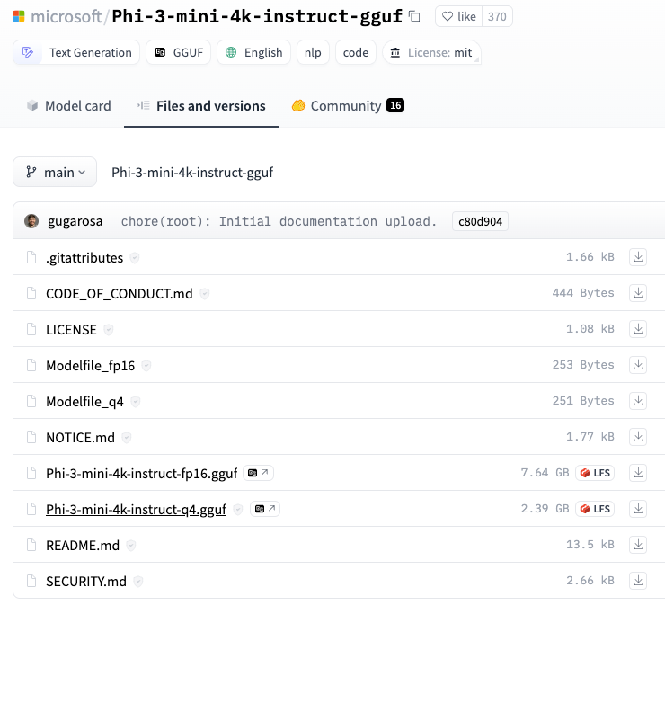
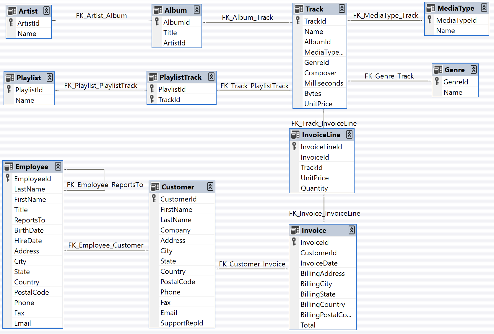

# Phi-3-SQL
SQL generation with Microsoft Phi-3 Models Experiments  

## Setup instructions 

### Llama Cpp
Create a virtual environment and install dependencies 

https://github.com/abetlen/llama-cpp-python 
This is the library that we will use to instantiate a local LLM

Specifically for mac : 
    CMAKE_ARGS="-DLLAMA_METAL=on" pip install llama-cpp-python

For other OS, follow instructions on GitHub / PyPi page of library. 

### Phi-3

Download gguf file from https://huggingface.co/microsoft/Phi-3-mini-4k-instruct-gguf/tree/main 

Place gguf file in "models" dir

Smaller version will be easier to work with. I.e. Phi-3-mini-4k-instruct-q4.gguf (2.x GB)

### Libraries (LangChain and ChainLit ecosystems)

pip install numpy jupyter pandas sentencepiece pypdf  chainlit langchain langchain-core langchain-community langchain-cli

### Sample Data

"Chinook" sample schema is used from https://github.com/lerocha/chinook-database

Chinook data model represents a digital media store, including tables for artists, albums, media tracks, invoices and customers.

This is a good test for Joins, Aggregates and synonyms . 

### Approach for prompt 
This was the source of Prompt text : https://github.com/defog-ai/sqlcoder/blob/main/defog_sqlcoder_colab.ipynb